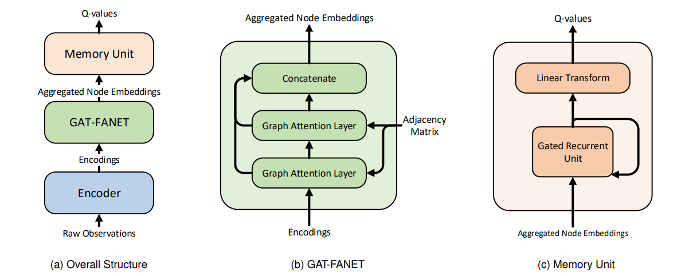

# Soft-DRGN

本仓库包含了以下工作的官方PyTorch实现：

* Soft-DRGN：[Multi-UAV Navigation for Partially Observable Communication Coverage by Graph Reinforcement Learning](https://www.techrxiv.org/articles/preprint/Multi-UAV_Navigation_for_Partially_Observable_Communication_Coverage_by_Graph_Reinforcement_Learning/15048273/2) *(IEEE transactions on Mobile Computing, 2022)*
* [Space-Air-Ground Integrated Mobile Crowdsensing for Partially Observable Data Collection by Multi-Scale Convolutional Graph Reinforcement]() *(Entropy, 2022)*



# 使用方法

## 安装（Linux 或 Windows）

```bash
conda create -n sdrgn python=3.7
conda activate sdrgn
conda install pytorch=1.8.0 -c pytorch
pip install -r requirements.txt
```

## 训练 (GPU）

以在[无人机移动通信基站 (UAV mobile-base station, UAV-MBS)](https://www.techrxiv.org/articles/preprint/Multi-UAV_Navigation_for_Partially_Observable_Communication_Coverage_by_Graph_Reinforcement_Learning/15048273/2) 场景中训练Soft-DRGN算法为例：

```bash
export CONFIG=configs/scenarios/continuous_uav_mbs/sdrgn.yaml
CUDA_VISIBLE_DEVICES=0 python run.py --config=$CONFIG --exp_name=uav-mbs_sdrgn
```

上述命令会在 `<root_dir>/checkpoint`中创建一个 `<exp_name>`为名称的工作文件夹，配置文件、日志和ckpt都会存在这里。

### 使用TensorBoard监督训练情况

```bash
cd checkpoints/uav-mbs_sdrgn
tensorboard --logdir=./ --bind_all
```

## 可视化渲染

假设你已经用上面的脚本训练了模型，执行下面的命令可以进行可视化：

```bash
CUDA_VISIBLE_DEVICES=0 python run.py --config=$CONFIG --exp_name=uav-mbs_sdrgn --display
```

## 测试模型

假设你已经用上面的脚本训练了模型：

```bash
CUDA_VISIBLE_DEVICES=0 python run.py --config=$CONFIG --exp_name=uav-mbs_sdrgn --evaluate --eval_result_name=out.csv
```

会在checkpoints/uav-mbs_sdrgn文件夹内生成一个out.csv文件，其内记录了测试结果。

# 已实现的功能

## 支持的算法

| 算法      | 基础配置文件                       | 训练配置文件                     |
| :-------- | ---------------------------------- | -------------------------------- |
| DQN       | configs/configs_base/dqn.yaml      | configs/<env_name>/dqn.yaml      |
| DGN       | configs/configs_base/dgn.yaml      | configs/<env_name>/dgn.yaml      |
| AC-DGN    | configs/configs_base/ac_dgn.yaml   | configs/<env_name>/ac_dgn.yaml   |
| DRGN      | configs/configs_base/drgn.yaml     | configs/<env_name>/drgn.yaml     |
| AC-DRGN   | configs/configs_base/ac_drgn.yaml  | configs/<env_name>/ac_drgn.yaml  |
| Soft-DGN  | configs/configs_base/sdgn.yaml     | configs/<env_name>/sdgn.yaml     |
| SAC-DGN   | configs/configs_base/sac_dgn.yaml  | configs/<env_name>/sac_dgn.yaml  |
| Soft-DRGN | configs/configs_base/sdrgn.yaml    | configs/<env_name>/sdrgn.yaml    |
| SAC-DRGN  | configs/configs_base/sac_drgn.yaml | configs/<env_name>/sac_drgn.yaml |
| MAAC      | configs/configs_base/maac.yaml     | configs/<env_name>/maac.yaml     |
| HGN       | configs/configs_base/hgn.yaml      | configs/ctc/hgn.yaml             |

## 支持的实验场景

| 场景                                             | 基础配置文件                        | 描述                                                                   |
| ------------------------------------------------ | ----------------------------------- | ---------------------------------------------------------------------- |
| Surviving                                        | configs/survivng/env.yaml           | 一群同构智能体在地图中采集食物，避免饥饿                               |
| Continuous UAV Mobile Base Station               | configs/continuous_uav_mbs/env.yaml | 一群同构无人机在地图中为地面的用户提供通信覆盖                         |
| Continuous UAV Mobile Base Station with charging | configs/continuous_uav_mcs/env.yaml | 一群同构无人机在地图中为地面的用户提供通信覆盖（考虑充电、卫星等因素） |
| Collective Treasure Colloection                  | configs/ctc/env.yaml                | 复现了MAAC论文中的ctc，用来测试HGN等异构算法                           |

## 如何添加新算法

1. 在modules模块中，定义神经网络结构，见[modules帮助文档](docs/modules-zh.md)
2. 在agents模块中，定义新的Agent类，见[agents帮助文档](docs/agents-zh.md)
3. 在configs模块中，在base_configs文件夹建立新的yaml配置文件，见[configs帮助文档](docs/configs-zh.md)
4. 在configs模块中，在<scenario_name>文件夹中创建对应的yaml配置。

## 如何添加新环境

1. 在scenarios模块中，定义新的Environment类，见[scenarios帮助文档](docs/scenarios-zh.md)
2. 在configs模块中，创建名为<scenario_name>的文件夹，在其中创建env.yaml，见[configs帮助文档](docs/configs-zh.yaml)

## 关于异构多智能体算法与场景

我们针对异构的多智能体算法与场景，编写了一个[参考文档](docs/heterogeneous_madrl.md)，如果需要自己实现一些拓展可以参考。

# 引用

如果你觉得本仓库对你有所帮助，请考虑引用以下论文。

* Soft-DRGN

```
@article{ye2022sdrgn,
  author={Ye, Zhenhui and Wang, Ke and Chen, Yining and Jiang, Xiaohong and Song, Guanghua},
  journal={IEEE Transactions on Mobile Computing}, 
  title={Multi-UAV Navigation for Partially Observable Communication Coverage by Graph Reinforcement Learning}, 
  year={2022},
  volume={},
  number={},
  pages={1-1},
  doi={10.1109/TMC.2022.3146881}}
```

* MS-SDRGN

```
@article{ren2022ms-sdrgn,

}
```
